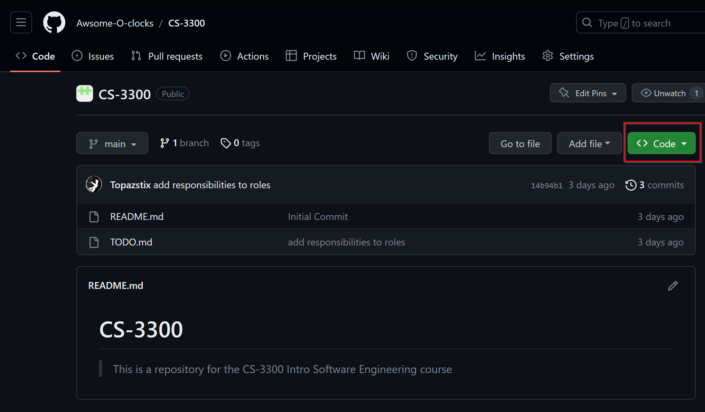
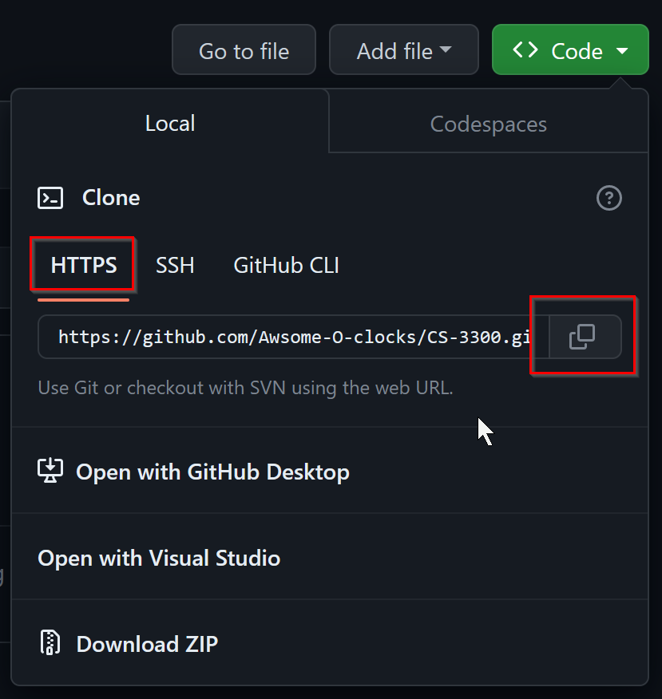

# Github Commandline Cheatsheet


## Install git locally on your machine
1. [Follow these instructions for install git](https://git-scm.com/)
2. Once git is installed locally, open a terminal (powershell for windows, terminal for linux/mac) and run the following commands to register your github username globally.
    ```bash
    git config --global user.name "github_username"
    git config --global user.email "github_email"

    ## OPTIONAL IF YOU WANT COLORFUL OUTPUT
    git config --global color.ui auto

    ## EXAMPLE:
    git config --global user.name "topazstix"
    git config --global user.email "topazstix@protonmail.com"
    ```

## Using github and git together
- Our repositories will be located within our [organization](https://github.com/orgs/Awsome-O-clocks/repositories)
- To clone a repository to your local machine, navigate to the repository you want to clone and click the green "Code" button. Copy the link provided.
    - 
    - 
- Navigate to your terminal and run the following command in a directory you can easily find. *An example, I place my school related folders in Documents/College/Year/Course_Name.*
    ```bash
    git clone {LINK_FROM_ABOVE}

    ## EXAMPLE:
    git clone https://github.com/Awsome-O-clocks/CS-3300.git
    ```

---

> Addtional documentation will be added with respect to how to create local branches and submit pull requests into development branches.