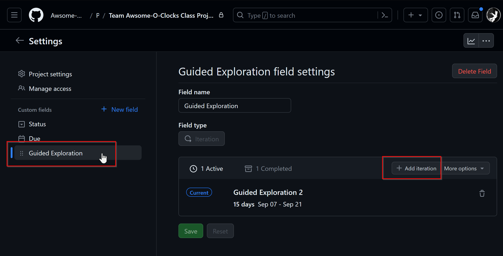
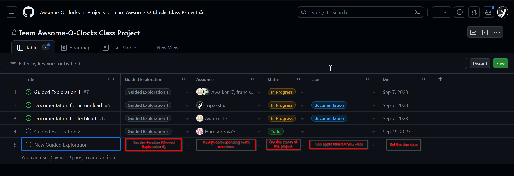

# Scrum Lead Github Projects

## Github Organization Projects

- Projects are located on the ***Projects*** tab of the organization page.

    - 

    - Open the project

    - 

    - 

- Projects will be used to track our progress as a team and assign specific tasks to members of our team.

- Projects will be broken down into the following categories:

    - **To Do** - Tasks that need to be completed
    - **In Progress** - Tasks that are currently being worked on
    - **Done** - Tasks that have been completed

- Our iterations will follow the example of "Guided Exploration #", with length determined by the start and end date of our given assignments

    - To create a new iteration:

    - 

    - 

    - If dates for the iteration need to be changed, click the hyper-linked *date* as shown below, and adjust as necessary

    - 

- Create and assign a general task for the Guided Exploration to the entire team to track our progress

    - 

    - 

