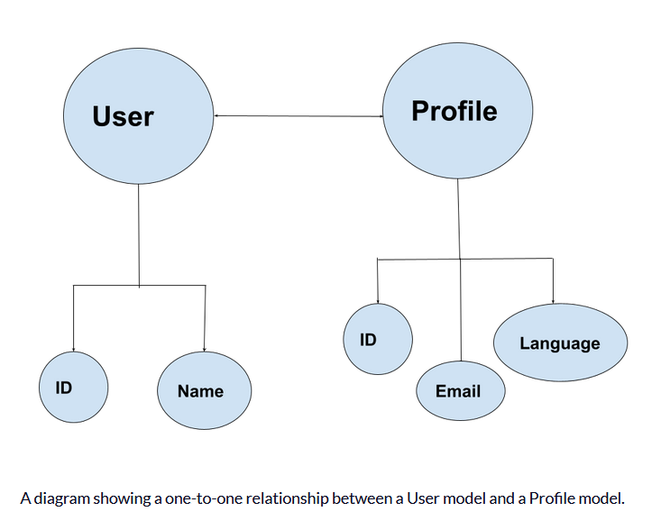
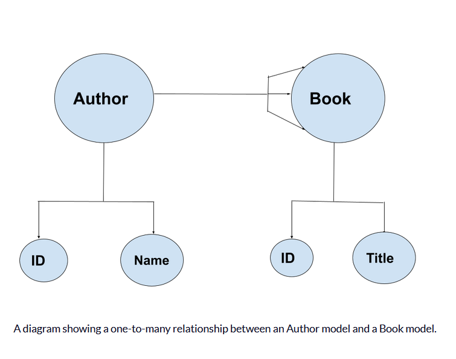
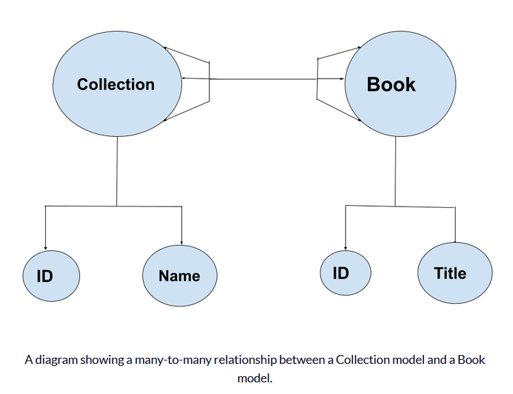

# Django Models and Relationships

## Models
In the Django framework, models are what define the structure of the data that is stored in the database. Django models are classes that inherit from the `django.db.models.Model` class. Each attribute of the model class represents a database field. Django models are defined in the `models.py` file of the application.

<br>

```python
## EXAMPLE PYTHON MODEL:

class Student(models.Model):
    MAJOR = (
        ("CSCI-BS", "BS in Computer Science"),
        ("CPEN-BS", "BS in Computer Engineering"),
        ("BIGD-BI", "BI in Game Design and Development"),
        ("BICS-BI", "BI in Computer Science"),
        ("BISC-BI", "BI in Computer Security"),
        ("CSCI-BA", "BA in Computer Science"),
        ("DASE-BS", "BS in Data Analytics and Systems Engineering")
    )
    name = models.CharField(max_length=200)
    email = models.CharField("UCCS Email", max_length=200)
    major = models.CharField(max_length=200, choices=MAJOR)
    portfolio = models.OneToOneField(Portfolio, on_delete=models.CASCADE, unique=True)
    
    # Define default String to return the name for representing the Model object."
    def __str__(self):
        return self.name

    # Returns the URL to access a particular instance of MyModelName.
    # if you define this method then Django will automatically
    # add a "View on Site" button to the model's record editing screens in the Admin site
    def get_absolute_url(self):
        return reverse('student-detail', args=[str(self.id)])  

```

## Relationships
Django models correspond to records within a database. Each model has attributes which will store specific data into the database as a field. Relationships allowed by each model can be one of the following:

1. One-to-one:
    - 
2. One-to-many:
    - 
3. Many-to-many:
    - 

---

# References
- [Django Model Relationships](https://www.freecodecamp.org/news/django-model-relationships/)
- [Django model tech docs](https://docs.djangoproject.com/en/4.2/topics/db/models/)
